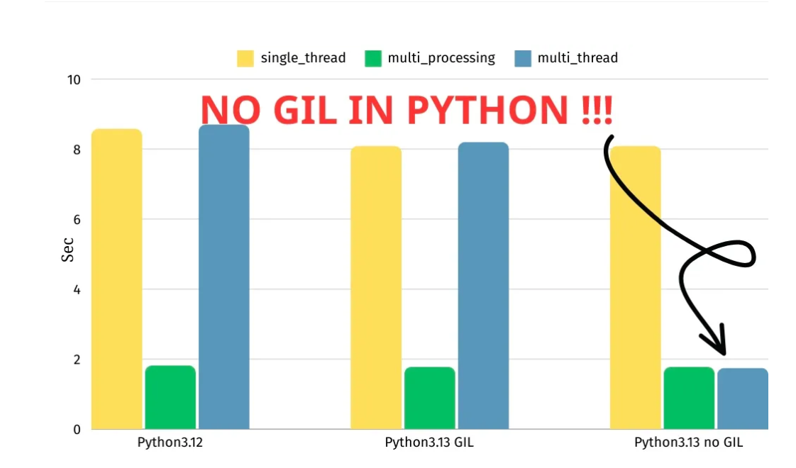

# 加速方案备记


## python 解释器实现比较

| 解释器       | 说明                       | 是否有并发问题               |
|--------------|----------------------------|----------------------------|
| CPython      | 官方，稳定，广泛           | GIL, 速度较慢                   |
| PyPy         | JIT，更快的代码执行速度    | 17年提，但至今未能去掉GIL，支持python2, python3.10  |
| Jython       | java实现，               | 无GIL, 只支持到  python2?         |
| IronPython   | .NET实现，编译成IL中间码  | 元GIL, 只支持python2和python3.4   |

## pypy中的多线程比较
```python
$ python3 pypy-vs-py.py
Took 0.632 seconds
threads Took 0.650 seconds

$ pypy3 pypy-vs-py.py
Took 0.041 seconds
threads Took 0.168 seconds
```

## tidy3d中使用pypy安装依赖遇到的问题
* scipy 的c-extension没有安装成功，需要c编译器和openblas
* matplotlib 安装没有报错，但是import 错误
* pywinpty 需要rust环境

## 方法：
* 最简单的办法是使用多进程
* python中使用c-extension, [Py_BEGIN_ALLOW_THREADS宏](https://docs.python.org/3/c-api/init.html#c.Py_BEGIN_ALLOW_THREADS)。
  numpy 使用这种方法
* python3.13 实验性支持 no gil, 需要自己编译
  
  

## 参考：

- https://stackoverflow.com/questions/41449851/python-and-threads-with-pypy
- https://docs.python.org/3/library/threading.html
- https://pypy.org/posts/2017/08/lets-remove-global-interpreter-lock-748023554216649595.html
- https://doc.pypy.org/en/latest/faq.html#does-pypy-have-a-gil-why
- https://zhuanlan.zhihu.com/p/346830613
- https://medium.com/@r_bilan/python-3-13-without-the-gil-a-game-changer-for-concurrency-5e035500f0da